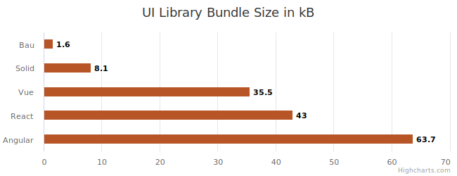

# Bau.js

A Javascript library to write reactive user interface for the web under 300 lines of code.

No JSX, no templating, no virtual DOM, just a simple way to write UI components using Javascript.

Bau is reactive, data mutation drives the various views binded to this data. When the data is modified, the mutation is intercepted via carefully crafted Javascript proxies, and the DOM is updated accordingly.

In addition to this core library, a set of others has been released to provide a full ecosystem:

- [bau-css](./bau-css): a CSS in JS library in 33 lines of code.
- [bau-ui](./bau-ui): a set of themable components such as Button, Input, Tabs, Tree View, Model, etc... See a [live preview](https://grucloud.github.io/bau/bau-ui) of these components.
- [bau-router](./bau-router): a router with nested route, asynchronous loading, layout. Under 0.6kB
- [bau-kit](./examples/bau-kit): a Multi Page App starter kit, all of these features packed under 5KB, a **20X** decreased compared to the combo React/Redux/React Router/Style Component.
- [bausaurus](https://grucloud.github.io/bau/bausaurus/): A Static Site Generator from Markdown content.

## Bundle size

Let's compare the bundle sizes thanks to [bundlephobia](https://bundlephobia.com/):



## Sample code

Bau aims to be easy to use and its API surface consits of only 3 functions: `tags`, `state` and `bind`

```js
// main.js
// Import the library
import Bau from "@grucloud/bau";

// Instantiate the library
const bau = Bau();

// Destructure any html tags used to describe the component
const { button, span } = bau.tags;

// Create a state containing an integer
const counter = bau.state(0);

// Create a component defined by a function that return a real DOM node.
function Counter() {
  return span(
    "❤️ ",
    counter,
    " ",
    button({ onclick: () => ++counter.val }, "👍"),
    button({ onclick: () => --counter.val }, "👎")
  );
}

// Your html file must contain an element with the id "app"
document.getElementById("app").replaceChildren(Counter());
```

## Dependencies

Install the dependencies:

```sh
npm install @grucloud/bau
```

## Examples

Have a look at the [examples](./examples) directory to find out how to use this library.

Check out the minimalistic [hello world example](https://codesandbox.io/s/bau-helloworld-twdxl5?file=/src/index.js) on CodeSanbox

## Benchmark

Bau has been benchmarked against other thanks to the project [js-framework-benchmark](https://github.com/krausest/js-framework-benchmark),
It scores very well on most use cases, see prelimanary results [here](https://github.com/krausest/js-framework-benchmark/pull/1271)

The Chrome Lighthouse perfomance tool reports an overall 100% score even for an app built with all Bau UI components.


## Typescript

The Bau ecosystem exports Typescript definition files allowing to improve the Developer's eXperience. Enjoy the code completion with VS Code or your favorite IDE, which is obviously VS Code.

## Guide

- [Lifecycle Methods: bauCreated, bauMounted, bauUnmounted](./doc/BauLifecycle.md)
- [create a state array and display views](./doc/BauStateArray.md)

## Contribution

Please report bugs and suggestions to https://github.com/grucloud/bau

## History

Bau is mostly inspired by [van.js](https://vanjs.org/), with the following differences:

- Van.js only support primitive value as state, Bau state management also supports array and object.
- Bau supports lifecycle methods such as **bauCreated**, **bauMounted** and **bauUnmounted**
- The `bind` function input parameters are differents, in van.js, they spreads the state dependencies and the render function at the end, bau `bind` uses an object with keys: deps, render, renderItem and eventually more in the future.

```js
const scrollState = bau.state(0);

const ScrollNumber = () =>
  bau.bind({
    deps: [scrollState],
    render:
      ({ element }) =>
      (scroll) =>
        div({ class: "scroll-number" }, "scroll: ", scroll),
  });
```

- Bau does not use a global variable, multiple instances of Bau could eventually be created.

```js
import Bau from "@grucloud/bau";
const bau = Bau();
const { div } = bau.tags;
```

- Bau promotes only one paradigm: views derive from the state. Van could mix paradigms, imperative and state derived view. The imperative way is when your code directly maniplates the DOM, in the same way as vanilla js and jquery. This style of programming is error prone, therefore, preventing its use makes bau _hard to misuse_
- Bau supports undefined or null attribute, see [issue 39](https://github.com/vanjs-org/van/pull/39)
