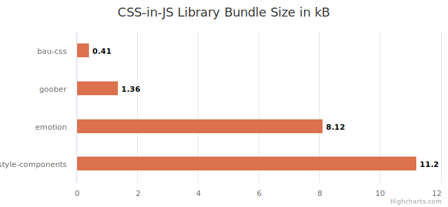

# BauCss

A CSS in JS library in less than [35 lines of code](./bau-css.js).

_BauCss_ exports 3 functions: `css`, `keyframes`, and `createGlobalStyles`.

This API is the same as other popular css-in-js libraries such as [styled-components](https://styled-components.com/), [emotion](https://emotion.sh/) and [goober](https://goober.js.org/).

_BauCss_ is framework agnostic and integrates with [Bau](https://github.com/grucloud/bau), React, Preact, SolidJs etc ...

## Bundle size

Let's compare the bundle sizes thanks to [bundlephobia](https://bundlephobia.com/):



The difference is between 3 times and 26 times leaner.

## Workflow

Install the dependencies:

```sh
npm install @grucloud/bau-css
```

Import `@grucloud/bau-css` and instantiate the library:

```js
import BauCss from "@grucloud/bau-css";

const { css, keyframes, createGlobalStyles } = BauCss();
```

The following [example](./examples/bau-bau-css/main.js) demonstrates how to use the _css_ and _keyframes_ functions with the [Bau reactive library](https://github.com/grucloud/bau).

```js
import Bau from "@grucloud/bau";
import BauCss from "@grucloud/bau-css";

const bauCss = BauCss();
const { css, keyframes } = bauCss;

const bau = Bau({});
const { p, h1, div } = bau.tags;

const color = "red";
const backgroundColor = "teal";

const rotate = keyframes`
0% {transform: rotate(0deg);}
100% {transform: rotate(360deg);}
`;

createGlobalStyles`
:root {
  background-color: ${backgroundColor};
  font-family: Open-Sans, Helvetica, Sans-Serif;
}
`;

const App = () =>
  div(
    {
      class: css`
        border: ${color} dotted 1px;
        display: flex;
        flex-direction: column;
        justify-content: center;
        align-items: center;
        & h1 {
          &:hover {
            animation: ${rotate} 4s infinite;
          }
        }
      `,
    },
    h1("Hello BauCss"),
    p("Hover over the title to start the animation")
  );

document.getElementById("app").replaceChildren(App({}));
```

Notice that the new [nested css feature](https://www.w3.org/TR/css-nesting-1/) is being leveraged in this library. Not only it makes the bundle size more than 20 times smaller, it is also significantly faster at runtime.
Under the hood, other CSS in JS libraries performs the following steps:

- 1 Build the css string through the template literal, a.k.a the css content inside a backtick.
- 2 Parses the given css to produce an abstract syntax tree (AST), often with regular expression which are notoriously slow and riddled with bugs.
- 3 Transforms the AST from nested css syntax into the old css way.
- 4 Stringified the css object model.
- 5 Infer a class name/keyframes by hashing the stringified css.
- 6 Add a style dom element in the DOM.

_BauCss_ skips steps 2, 3 and 4 as no longer needed because modern browers natively support nested CSS.

## Examples

_bau-css_ integrates seamlessly with UI libraries, here is a list of examples:

- [React with bau-css](./examples/react-bau-css)
- [Bau with bau-css](./examples/bau-bau-css)
- [Vanilla JS with bau-css](./examples/vanillajs-bau-css)

## Contribution

Bugs and suggestion can be discussed on its [GitHub project page](https://github.com/grucloud/bau/tree/main/bau-css).
